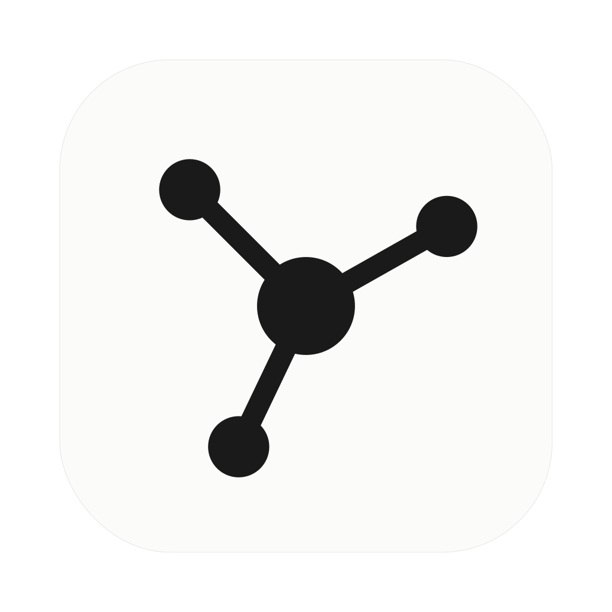

<p align="center">
  
</p>

<h1 align="center">Refman</h1>

<p align="center">A native macOS reference manager (Mendeley-style), built with Swift.</p>

> 🤖 **Vibecoded with Claude.** This project is written end-to-end by
> [Claude](https://claude.com) (Anthropic) via Claude Code — every line of code,
> from the database layer to the SwiftUI app to this README, produced by AI from
> natural-language prompts. No line was hand-written. Enjoy it for what it is.

- **Library**: SQLite (GRDB) with FTS5 full-text search; PDFs stored
  content-addressed by sha256 under `~/Library/Application Support/Refman/Storage`.
- **Import**: drag-and-drop or ⌘I; extracts text via PDFKit, scans for DOI/arXiv
  IDs, resolves metadata against CrossRef and the arXiv API. `.bib`/`.ris` import too.
- **Reader**: PDFKit viewer with highlight/underline/note annotations, written
  into the PDF itself *and* mirrored to SQLite (searchable, listable, syncable).
- **Export**: BibTeX, RIS, CSL-JSON.
- **Assistant**: local-LLM chat over the [Agent Client Protocol](https://agentclientprotocol.com).
  The app spawns `refman-agent` (an ACP↔Ollama bridge) and exposes library
  tools (`search_library`, `get_document_text`, `get_annotations`, …) that the
  model calls to ground its answers in your actual papers.

## Run

```sh
swift run Refman
```

Requirements: macOS 14+, Swift 6.2+ toolchain. For the assistant: [Ollama](https://ollama.com)
running locally with at least one tool-capable model pulled (e.g. `ollama pull qwen3:14b`).
Override with `REFMAN_OLLAMA_MODEL` / `REFMAN_OLLAMA_HOST`.

## Build a macOS app

```sh
scripts/build_app.sh
open dist/Refman.app
```

The bundle includes both the SwiftUI app and the bundled `refman-agent` used by
the Assistant. The script ad-hoc signs the app for local use; set
`SKIP_CODESIGN=1` to skip signing.

On first launch, open Terminal and paste the following, then open the app
normally:

```sh
sudo /usr/bin/xattr -dr com.apple.quarantine /Applications/Refman.app
```

After the first install, the app updates itself: **Refman → Check for Updates…**
pulls the latest GitHub release and relaunches, no quarantine step needed.

## Test

```sh
swift test                      # 79 unit/integration tests
python3 scripts/acp_smoke.py    # end-to-end ACP agent test (needs Ollama)
```

## Layout

```
Sources/RefmanCore/    # UI-free engine: database, storage, metadata, citation IO, ACP
Sources/Refman/        # SwiftUI app (library browser, PDF reader, assistant panel)
Sources/RefmanAgent/   # refman-agent: ACP agent bridging to Ollama
Tests/RefmanCoreTests/
```

See `todo.md` for status and roadmap (citeproc bibliographies and CloudKit
sync across devices are the next phases).
